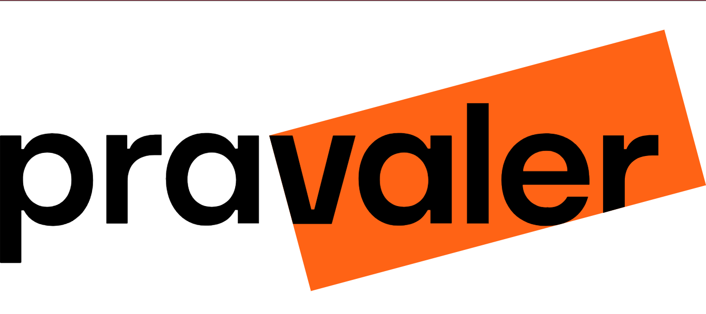
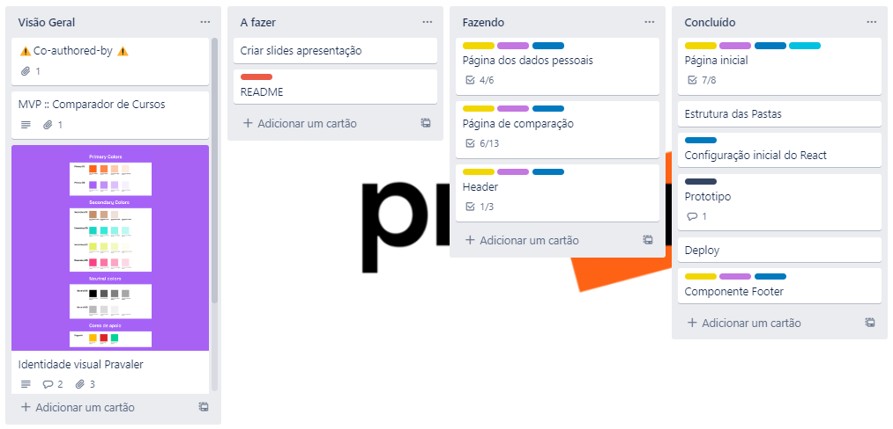
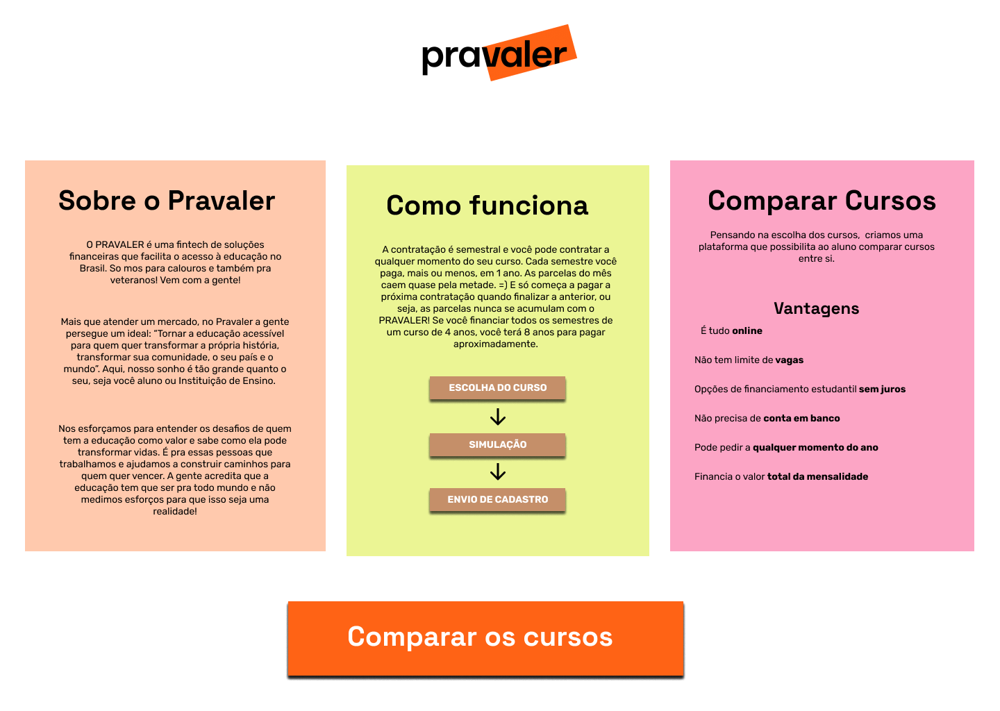
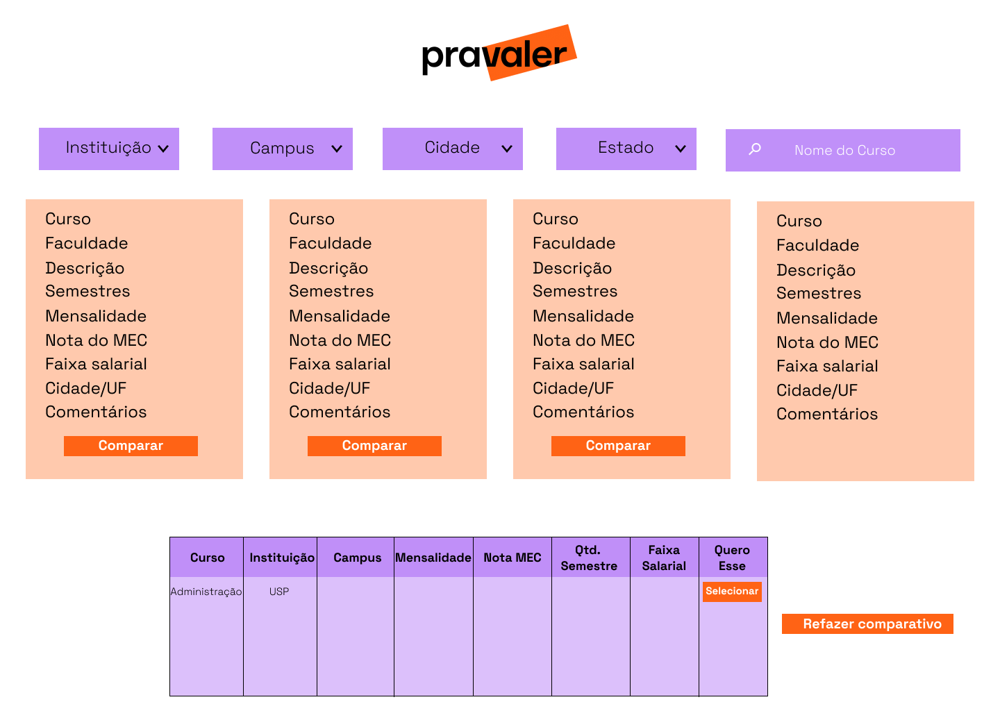
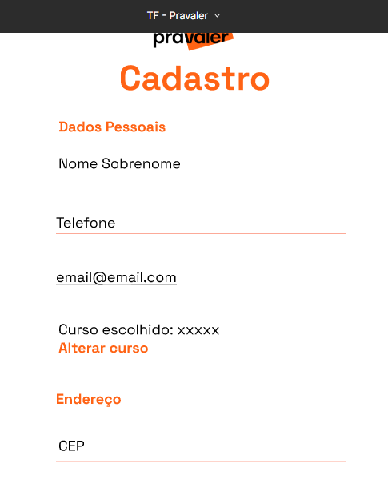
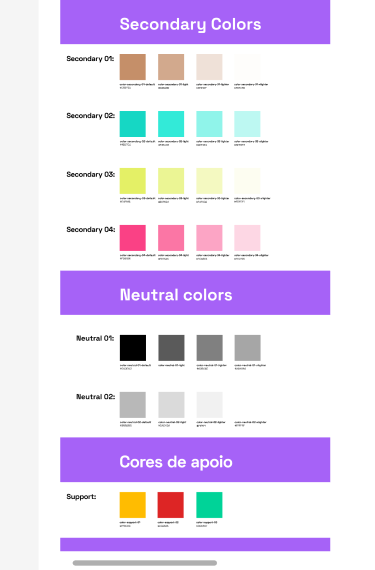

# Desenvolvimento web (MVP) : Comparador de Cursos

Nossa equipe de Desenvolvedoras recebeu uma tarefa enviada pela empresa Pravaler, onde deveriamos criar uma aplicação em que o aluno possa saber como funciona o crédito, o que ele precisa fazer para contratá-lo, apresentar
o comparador de cursos e encorajá-lo a usar, exibindo na tela funções de escolhe filtrando as principais informações requeridas pelo usuário. Ressaltando que este projeto foi desenvolvido especialmente para o Talent fest da Laboratória brasil , onde as empresas lançam desafios  e as desenvolvedoras  formadas tem apenas quatro dia pra entregar a solução, sendo tambem as apresentações transmitida via  Yutube.

## 1. Planejamento e Organização

O projeto foi desenvolvido por cinco mulheres desenvolvedoras front end contudo implementamos as medotodogias ágeis, e a principal ferramenta utilizada para nossa organização foi o Trello.

Nele trabalhamos cada história de usuário e esmiuçamos em Baby Steps, o que facilitou muito a nossa comunicação e desenvolvimento.

Outro ponto bastante positivo, foi que procuramos fazer o projeto na sua grande maioria em pair programming, o que nos ajudou a chegarmos ainda mais perto do resultado esperado.

## 2. Protótipo de Alta Fidelidade

O protótipo de alta fidelidade foi desenvolvido na ferramenta do Figma.

## 3. Paleta de Cores

Nossa paleta de cores foi inspirada no Logo da  empresa .

#### Critérios de aceitação

- [x] Interface que defina a finalidade da aplicação.
- [x] Opção de comparar dos cursos.

#### Definição de conteúdo

 Utilizamos  uma API com os dados que poderão ser utilizados para a comparação , disponibilizada pela Pravaler com os seguintes dados, onde usuário poderá filtrar os cursos escolhidos.
São eles:
• Nome do curso
• Nome da faculdade (IES)
• Descrição do curso
• Quantidade de semestres
• Mensalidade
• Nota do mec
• Faixa salarial
• Cidade / UF
• Comentários
Nesta tela, deve ser possível refazer a escolha das opções (limpar selecionados
anteriormente e escolher novos).
Caso o aluno tenha interesse em um dos cursos apresentados, deve ter a opção de um botão
“quero esse”.

- Página dos dados pessoais
- Ao clicar no botão “quero este”, o aluno deve ser direcionado para uma página de contato,
onde conterá infomações do curso selecionado e um formulário para o preenchimento dos

#### Critérios de aceitação

- [x] Opção de cadastro.
- [x] Voltar para a página de login.

#### Critérios de aceitação

- [x] Campo de pesquisa
- [x] Campo para para filtro de cursos

## 4. Tecnologias Utilizadas

 
## 5. Considerações

<table>
<td>
  

     
  

  <h3 align="center">Flávia Dantas</h3>
  

     
  

  

     
  

  

</td>

<td>
  

     
  

  <h3 align="center">Julia Benedicto</h3>
  

     
  

    

     
  

  

</td>

<td>
  

     
  

  <h3 align="center">Letícia Antunes</h3>
  

     
  

    

     
  

  

</td>

<td>
  

     
  

  <h3 align="center">Suelen Escórcio</h3>
  

     
  

    

     
  

  

</td>

<td>
  

     
  

  <h3 align="center">Vanessa Borges</h3>
  

     
  

    

     
  

  

</td>

</table>

## 6. Agradecimentos

- Agradecimentos especiais a equipe de programadores do Pravaler  ao apoio a nossa equipe, que nos deu total suporte durante o desafio do Talent Fest Brasil da <a href="https://www.laboratoria.la/br">Laboratória</a>.

- Agradecimento especial a Marcela Godoy e Leticia Cipriano, que nos acompanhou em todo desafio.

