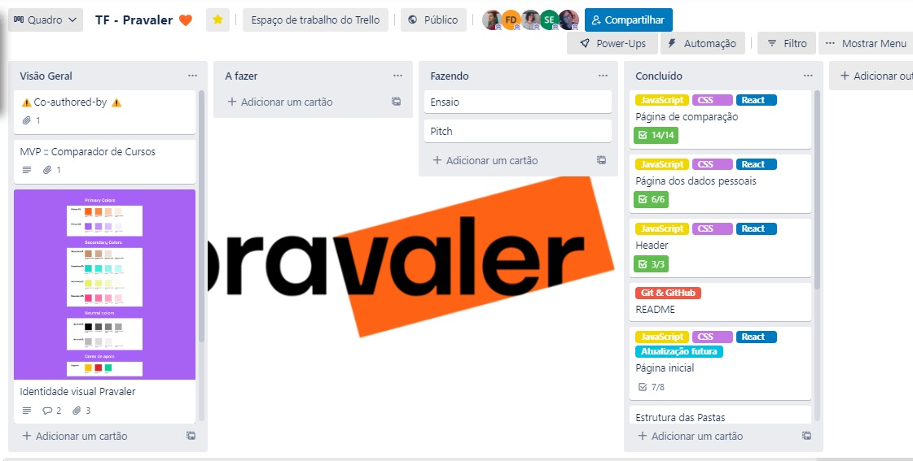

# Desenvolvimento web (MVP) : Comparador de Cursos

🔗 [Link da aplicação](https://pravaler-comparador.netlify.app/) 🔗

Nossa equipe de Desenvolvedoras recebeu uma tarefa enviada pela empresa Pravaler, onde deveríamos criar uma aplicação web que permita que o aluno obtenha informações sobre os cursos, possa comparar e escolher um curso de graduação.
Sendo a página inicial como um convite ao aluno para conhecer mais sobre o Pravaler, saber como funciona o crédito, o que ele precisa fazer para contratá-lo, apresentar o comparador de cursos e encorajá-lo a usar.
A página do Comparador de cursos, mostra as opções de curso oferecidas ao aluno, assim ele pode escolher três opções e pode visualizar um comparativo com as informações sobre os cursos. 
Uma página de dados pessoais ao clicar no botão  “Selecionar” na tabela, o aluno é redirecionado para uma página de cadastro, onde conterá um formulário para o preenchimento dos dados pessoais: nome, telefone, email, endereço (rua, bairro, cidade, uf).
Ressaltando que este projeto foi desenvolvido especialmente para o Talent Fest da Laboratória Brasil , onde as empresas lançam um desafio e as desenvolvedoras formadas têm apenas quatro dias para entregar a solução, tendo também as apresentações transmitidas via Youtube.

## 1. Planejamento e Organização
O projeto foi realizado em 3 dias utilizando a metodologia ágil KANBAN, por meio da plataforma [Trello](https://trello.com/b/oNRchXeg).

## 2. Protótipo de Alta Fidelidade

O protótipo de alta fidelidade foi desenvolvido na ferramenta do Figma.

---

---

## 3. Paleta de Cores

A paleta de cores foi inspirada na da empresa.

## 4. Tecnologias Utilizadas

 
## 5. Considerações

<table>
<td>
  

     
  

  <h3 align="center">Flávia Dantas</h3>
  

     
  

  

     
  

  

</td>

<td>
  

     
  

  <h3 align="center">Julia Benedicto</h3>
  

     
  

    

     
  

  

</td>

<td>
  

     
  

  <h3 align="center">Letícia Antunes</h3>
  

     
  

    

     
  

  

</td>

<td>
  

     
  

  <h3 align="center">Suelen Escórcio</h3>
  

     
  

    

     
  

  

</td>

<td>
  

     
  

  <h3 align="center">Vanessa Borges</h3>
  

     
  

    

     
  

  

</td>

</table>

## 6. Agradecimentos

- Agradecimentos especiais a equipe do Pravaler ao apoio a nossa equipe, que nos deu total suporte durante o desafio do Talent Fest Brasil da <a href="https://www.laboratoria.la/br">Laboratória</a>.

- Agradecimento especial a Marcela Godoy e Leticia Cipriano, que nos acompanhou em todo desafio.

